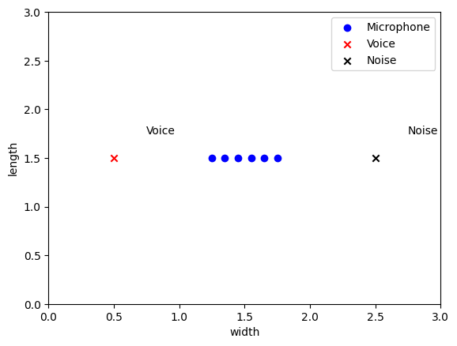

## Examples
The original recording may not be played back.
### №1 Cafe
| Microphone configuration| Room configuration|
|:------------------------|:------------------------:|
|  |  |

| Original| Reference Channel| MVDR |
|:------------------------:|:------------------------:|:------------------------:|
| </style> <audio src="sample/cafe/orig.wav" controls preload style="width: 250px; height: 50px;"></audio>  | <audio src="sample/cafe/ref.wav" controls preload style="width: 250px; height: 50px;"></audio>  | <audio src="sample/cafe/mvdr.wav" controls preload style="width: 250px; height: 50px;" ></audio> |

### №2 Kitchen
| Microphone configuration| Room configuration|
|:------------------------|:------------------------:|
|  |  |

| Original| Reference Channel| MVDR |
|:------------------------:|:------------------------:|:------------------------:|
| </style> <audio src="sample/kitchen/orig.wav" controls preload style="width: 250px; height: 50px;"></audio>  | <audio src="sample/kitchen/ref.wav" controls preload style="width: 250px; height: 50px;"></audio>  | <audio src="sample/kitchen/mvdr.wav" controls preload style="width: 250px; height: 50px;" ></audio> |

### №3 Bus
| Microphone configuration| Room configuration|
|:------------------------|:------------------------:|
|  |  |

| Original| Reference Channel| MVDR |
|:------------------------:|:------------------------:|:------------------------:|
| </style> <audio src="sample/bus/orig.wav" controls preload style="width: 250px; height: 50px;"></audio>  | <audio src="sample/bus/ref.wav" controls preload style="width: 250px; height: 50px;"></audio>  | <audio src="sample/bus/mvdr.wav" controls preload style="width: 250px; height: 50px;" ></audio> |

### №4 Metro
| Microphone configuration| Room configuration|
|:------------------------|:------------------------:|
|  |  |

| Original| Reference Channel| MVDR |
|:------------------------:|:------------------------:|:------------------------:|
| </style> <audio src="sample/metro/orig.wav" controls preload style="width: 250px; height: 50px;"></audio>  | <audio src="sample/metro/ref.wav" controls preload style="width: 250px; height: 50px;"></audio>  | <audio src="sample/metro/mvdr.wav" controls preload style="width: 250px; height: 50px;" ></audio> |

### №5 River
| Microphone configuration| Room configuration|
|:------------------------|:------------------------:|
|  |  |

| Original| Reference Channel| MVDR |
|:------------------------:|:------------------------:|:------------------------:|
| </style> <audio src="sample/river/orig.wav" controls preload style="width: 250px; height: 50px;"></audio>  | <audio src="sample/river/ref.wav" controls preload style="width: 250px; height: 50px;"></audio>  | <audio src="sample/river/mvdr.wav" controls preload style="width: 250px; height: 50px;" ></audio> |

### №6 Square
| Microphone configuration| Room configuration|
|:------------------------|:------------------------:|
|  |  |

| Original| Reference Channel| MVDR |
|:------------------------:|:------------------------:|:------------------------:|
| </style> <audio src="sample/square/orig.wav" controls preload style="width: 250px; height: 50px;"></audio>  | <audio src="sample/square/ref.wav" controls preload style="width: 250px; height: 50px;"></audio>  | <audio src="sample/square/mvdr.wav" controls preload style="width: 250px; height: 50px;" ></audio> |